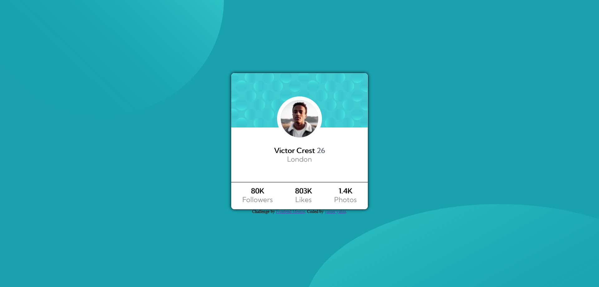

# Frontend Mentor - Profile card component solution

This is a solution to the [Profile card component challenge on Frontend Mentor](https://www.frontendmentor.io/challenges/profile-card-component-cfArpWshJ). Frontend Mentor challenges help you improve your coding skills by building realistic projects. 

## Table of contents

  - [Screenshot](#screenshot)
  - [Links](#links)
  - [Built with](#built-with)
  - [Useful resources](#useful-resources)
  - [Author](#author)

- Build out the project to the designs provided

### Screenshot

### Links

- Solution URL: 
- Live Site URL: [Add live site URL here](https://your-live-site-url.com)

### Built with

- CSS custom properties
- Flexbox

### Useful resources

- [css tricks](https://css-tricks.com/snippets/css/a-guide-to-flexbox/) - this helped me to understand flexbox more easily.

## Author
- Frontend Mentor - [@yasseryahiia](https://www.frontendmentor.io/profile/yasseryahiia)
